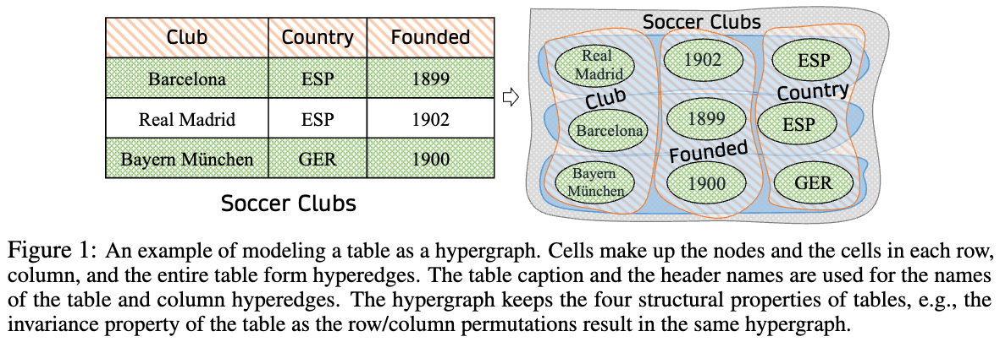

# HyTrel
A hypergraph-based tabular language model.

# Introduction
This repository contains the official implementation for the paper **HyTrel: Hypergraph-enhanced Tabular Data Representation Learning** with code, data, and checkpoints.



# Installation
It's recommended to use `python 3.9`.

Here is an example of creating the environment using [Anaconda](https://www.anaconda.com/). 
- Create the virtual environment using `conda create -n hytrel python=3.9`
- Install the required packages with the corresponding versions from `requirements.txt`

**Note**: If you encounter difficulty installing `torch_geometric`, please refer [here](https://pytorch-geometric.readthedocs.io/en/latest/install/installation.html) to install it according to your environment settings.

# Pretraining
-  Pre-process the raw data, slicing the big file into chunks, and put the `*.jsonl` files into the directory `/data/pretrain/chunks/`. Sample data is present [here](https://github.com/brickee/HyTrel/tree/main/data/pretrain/chunks) and the files can be used as reference.\
  **Note**: Pretraining data `*.jsonl` are acquired and preprocessed by using the scripts from the [TaBERT](https://github.com/facebookresearch/TaBERT?tab=readme-ov-file#commoncrawl-wdc-web-table-corpus-2015).
 
- Run `python parallel_clean.py` to clean and serialize the tables. \
  **Note**: We serialize the tables as [arrow](https://arrow.apache.org/docs/python/index.html) in consideration of memory usage.
  
- Run `sh pretrain_electra.sh` to pretrain HyTrel with the [ELECTRA](https://arxiv.org/abs/2105.02584) objective.
  
- Run `sh pretrain_contrast.sh` to pretrain HyTrel with the Contrastive objective.


# Evaluation
First put the [ELECTRA](https://arxiv.org/abs/2105.02584)-pretrained checkpoint to `/checkpoints/electra/`, and Contrast-pretrained checkpoint to `/checkpoints/contrast/`.
## [Column Type Annotation](https://paperswithcode.com/task/column-type-annotation)
- Put the data `{train, dev, test}.table_col_type.json` and `type_vocab.txt` into the directory `/data/col_ann/`.
  
- Run `sh evaluate_cta_electra.sh` with [ELECTRA](https://arxiv.org/abs/2105.02584)-pretrained checkpoint.

- Run `sh evaluate_cta_contrast.sh` with Contrast-pretrained checkpoint.

## [Column Property Annotation](https://paperswithcode.com/task/columns-property-annotation#:~:text=Column%20Property%20Annotation%20(CPA)%20refers,CPA%20are%20properties%20from%20vocabularies.)
- Put the data `{train, dev, test}.table_rel_extraction.json` and `relation_vocab.txt` into the directory `/data/col_rel/`.

- Run `sh evaluate_cpa_electra.sh` with [ELECTRA](https://arxiv.org/abs/2105.02584)-pretrained checkpoint.

- Run `sh evaluate_cpa_contrast.sh` with Contrast-pretrained checkpoint.

## Table Type Annotation
- Decompose `ttd.tar.gz` into `train, dev, test` data folders under the directory `/data/ttd/`.
  
- Run `sh evaluate_ttd_electra.sh` with [ELECTRA](https://arxiv.org/abs/2105.02584)-pretrained checkpoint.

- Run `sh evaluate_ttd_contrast.sh` with Contrast-pretrained checkpoint.

<!---
# Load Checkpoints for Custom Data
To appear.
-->

# Reference
Please cite our [paper](https://arxiv.org/pdf/2307.08623.pdf).


```text
@inproceedings{NEURIPS2023_66178bea,
 author = {Chen, Pei and Sarkar, Soumajyoti and Lausen, Leonard and Srinivasan, Balasubramaniam and Zha, Sheng and Huang, Ruihong and Karypis, George},
 booktitle = {Advances in Neural Information Processing Systems},
 editor = {A. Oh and T. Neumann and A. Globerson and K. Saenko and M. Hardt and S. Levine},
 pages = {32173--32193},
 publisher = {Curran Associates, Inc.},
 title = {HyTrel: Hypergraph-enhanced  Tabular Data Representation Learning},
 url = {https://proceedings.neurips.cc/paper_files/paper/2023/file/66178beae8f12fcd48699de95acc1152-Paper-Conference.pdf},
 volume = {36},
 year = {2023}
}
```
# Contact
For the data and model checkpoints, please find them in the `checkpoints` folder.

If you have more questions, please email: chen.pei518@163.com (Pei Chen)
